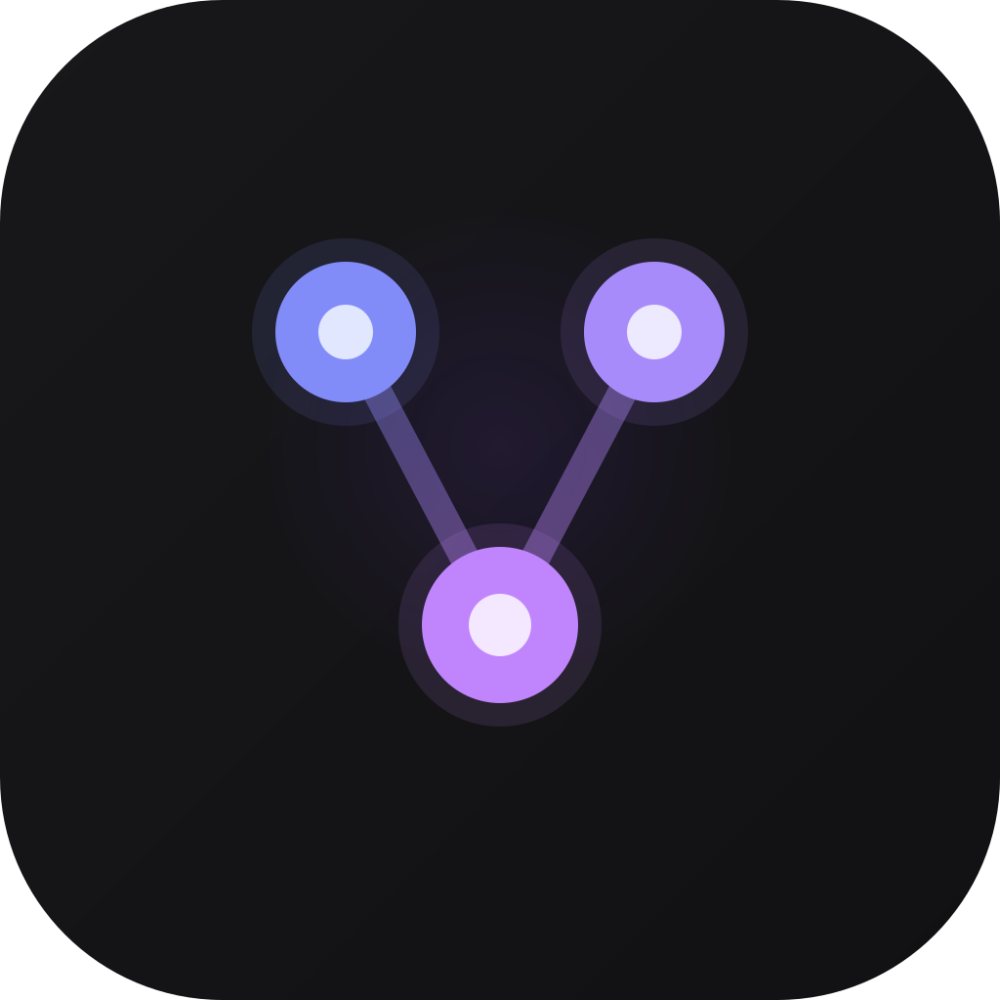

<p align="center">
  <a href="docs/screenshots/1.jpg"></a>&nbsp;
  <a href="docs/screenshots/7.png"></a>&nbsp;
  <a href="docs/screenshots/2.jpg"></a>&nbsp;
  <a href="docs/screenshots/8.png"></a>&nbsp;
  &nbsp;
  <a href="docs/screenshots/9.png"></a>&nbsp;
  <a href="docs/screenshots/3.jpg"></a>&nbsp;
  <a href="docs/screenshots/4.png"></a>&nbsp;
  <a href="docs/screenshots/6.png"></a>
</p>

<h1 align="center"><a href="https://777genius.github.io/claude_agent_teams_ui/">Claude Agent Teams UI</a></h1>

<p align="center">
  <strong><code>You're the CTO, agents are your team. They handle tasks themselves, message each other, review each other. You just look at the kanban board and drink coffee.</code></strong>
</p>

<p align="center">
  <a href="https://github.com/777genius/claude_agent_teams_ui/releases/latest"></a>&nbsp;
  <a href="https://github.com/777genius/claude_agent_teams_ui/actions/workflows/ci.yml"></a>&nbsp;
  <a href="https://discord.gg/RgBHMBsn"></a>
</p>

<p align="center">
  <sub>100% free, open source. No API keys. No configuration. Runs entirely locally. Not just coding agents.</sub>
</p>
<table>
<tr>
<td width="50%">

https://github.com/user-attachments/assets/9cae73cd-7f42-46e5-a8fb-ad6d41737ff8

</td>
<td width="50%">

https://github.com/user-attachments/assets/35e27989-726d-4059-8662-bae610e46b42

</td>
</tr>
</table>

<br />

## Installation

No prerequisites — Claude Code can be installed and configured directly from the app.

<table align="center">
<tr>
<td align="center">
  <a href="https://github.com/777genius/claude_agent_teams_ui/releases/latest/download/Claude-Agent-Teams-UI-arm64.dmg">
    
  </a>
  <br />
  <a href="https://github.com/777genius/claude_agent_teams_ui/releases/latest/download/Claude-Agent-Teams-UI-x64.dmg">
    
  </a>
</td>
<td align="center">
  <a href="https://github.com/777genius/claude_agent_teams_ui/releases/latest/download/Claude-Agent-Teams-UI-Setup.exe">
    
  </a>
  <br />
  <sub>May trigger SmartScreen — click "More info" → "Run anyway"</sub>
</td>
<td align="center">
  <a href="https://github.com/777genius/claude_agent_teams_ui/releases/latest/download/Claude-Agent-Teams-UI.AppImage">
    
  </a>
  <br />
  <a href="https://github.com/777genius/claude_agent_teams_ui/releases/latest/download/Claude-Agent-Teams-UI-amd64.deb">
    
  </a>&nbsp;
  <a href="https://github.com/777genius/claude_agent_teams_ui/releases/latest/download/Claude-Agent-Teams-UI-x86_64.rpm">
    
  </a>&nbsp;
  <a href="https://github.com/777genius/claude_agent_teams_ui/releases/latest/download/Claude-Agent-Teams-UI.pacman">
    
  </a>
</td>
</tr>
</table>

## Table of contents

- [Installation](#installation)
- [Table of contents](#table-of-contents)
- [What is this](#what-is-this)
- [Comparison](#comparison)
- [Quick start](#quick-start)
- [FAQ](#faq)
- [Development](#development)
- [Tech stack](#tech-stack)
  - [Build for distribution](#build-for-distribution)
  - [Scripts](#scripts)
- [Roadmap](#roadmap)
- [Contributing](#contributing)
- [Security](#security)
- [License](#license)

## What is this

A new approach to task management with AI agent teams.

- **Assemble your team** — create agent teams with different roles that work autonomously in parallel
- **Agents talk to each other** — they communicate, create and manage their own tasks, review, leave comments
- **Cross-team communication** — agents can fully communicate across different teams; you can configure or prompt them to collaborate and message each other between teams
- **Sit back and watch** — tasks change status on the kanban board while agents handle everything on their own
- **Review changes like in Cursor** — see what code each task changed, then approve, reject, or comment
- **Built-in review workflow** — easily see how agents review each other's tasks to make sure everything went exactly as planned
- **Full tool visibility** — inspect exactly which tools an agent used to complete each task
- **Task-specific logs and messages** — clearly see all Claude logs and messages in isolation for each individual task, making it easy to trace what happened for any assignment
- **Live process section** — see which agents are running processes and open URLs directly in the browser
- **Stay in control** — send a direct message to any agent, drop a comment on a task, or pick a quick action right on the kanban card whenever you want to clarify something or add new work
- **Flexible autonomy** — let agents run fully autonomous, or review and approve each action one by one (you'll get a notification) — configure the level of control that fits your security needs
- **Solo mode** — one-member team: a single agent that creates its own tasks and shows live progress. Saves tokens; can expand to a full team anytime

<details>
<summary><strong>More features</strong></summary>

- **Task creation with attachments** — send a message to the team lead with any attached images. The lead will automatically create a fully described task and attach your files directly to the task for complete context.

- **Deep session analysis** — detailed breakdown of what happened in each Claude session: bash commands, reasoning, subprocesses

- **Smart task-to-log/changes matching** — automatically links Claude session logs/changes to specific tasks

- **Advanced context monitoring system** — comprehensive breakdown of what consumes tokens at every step: user messages, Claude.md instructions, tool outputs, thinking text, and team coordination. Token usage, percentage of context window, and session cost are displayed for each category, with detailed views by category or size.

- **Recent tasks across projects** — browse the latest completed tasks from all your projects in one place

- **Zero-setup onboarding** — built-in Claude Code installation and authentication

- **Built-in code editor** — edit project files with Git support without leaving the app

- **Branch strategy** — choose via prompt: single branch or git worktree per agent

- **Team member stats** — global performance statistics per member

- **Attach code context** — reference files or snippets in messages, like in Cursor. You can also mention tasks using `#task-id`, or refer to another team with `@team-name` in your messages.

- **Notification system** — configurable alerts when tasks complete, agents need your response, new comments arrive, or errors occur

- **MCP integration** — supports the built-in `mcp-server` (see [mcp-server folder](./mcp-server)) for integrating external tools and extensible agent plugins out of the box

- **Post-compact context recovery** — when Claude compresses its context, the app restores the key team-management instructions so kanban/task-board coordination stays consistent and important operational context is not lost

- **Task context is preserved** — thanks to task descriptions, comments, and attachments, all essential information about each task remains available for ongoing work and future reference

- **Workflow history** — see the full timeline of each task: when and how its status changed, which agents were involved, and every action that led to the current state

</details>

## Comparison

| Feature | Claude Agent Teams UI | Vibe Kanban | Aperant | Cursor | Claude Code CLI |
|---|---|---|---|---|---|
| **Cross-team communication** | ✅ | ❌ | ❌ | — | ❌ |
| **Agent-to-agent messaging** | ✅ Native real-time mailbox | ❌ Agents are independent | ❌ Fixed pipeline | ❌ | ✅⚠️ Built-in (no UI) |
| **Linked tasks** | ✅ Cross-references in messages | ⚠️ Subtasks only | ❌ | ❌ | ❌ |
| **Session analysis** | ✅ 6-category token tracking | ❌ | ⚠️ Execution logs | ❌ | ❌ |
| **Task attachments** | ✅ Auto-attach, agents read & attach files | ❌ | ✅ Images + files | ⚠️ Chat session only | ❌ |
| **Hunk-level review** | ✅ Accept / reject individual hunks | ❌ | ❌ | ✅ | ❌ |
| **Built-in code editor** | ✅ With Git support | ❌ | ❌ | ✅ Full IDE | ❌ |
| **Full autonomy** | ✅ Agents create, assign, review tasks end-to-end | ❌ Human manages tasks | ❌ Fixed pipeline | ⚠️ Isolated tasks only | ✅⚠️ (no UI) |
| **Task dependencies (blocked by)** | ✅ Guaranteed ordering | ❌ | ⚠️ Within plan only | ❌ | ✅⚠️ (no UI, no notifications) |
| **Review workflow** | ✅ Agents review each other | ❌ | ⚠️ Auto QA pipeline | ❌ | ✅⚠️ (no UI) |
| **Zero setup** | ✅ | ❌ Config required | ❌ Config required | ✅ | ⚠️ CLI install required |
| **Kanban board** | ✅ 5 columns, real-time | ✅ | ✅ 6 columns (pipeline) | ❌ | ❌ |
| **Execution log viewer** | ✅ Tool calls, reasoning, timeline | ❌ | ✅ Phase-based logs | ✅ | ❌ |
| **Live processes** | ✅ View, stop, open URLs in browser | ❌ | ❌ | ✅ | ❌ |
| **Per-task code review** | ✅ Accept / reject / comment | ⚠️ PR-level only | ⚠️ File-level only | ✅ BugBot on PRs | ❌ |
| **Flexible autonomy** | ✅ Granular settings, per-action approval, notifications | ❌ | ⚠️ Plan approval only | ✅ | ✅ |
| **Git worktree isolation** | ✅ Optional | ⚠️ Mandatory | ⚠️ Mandatory | ✅ | ✅ |
| **Multi-agent backend** | 🗓️ [In development](https://github.com/Alishahryar1/free-claude-code) | ✅ 6+ agents | ✅ 11 providers | ✅ Multi-model | — |
| **Price** | **Free** | Free / $30 user/mo | Free | $0–$200/mo | Claude subscription |

---

## Quick start

1. **Download** the app for your platform (see [Installation](#installation))
2. **Launch** — On first run, the setup wizard will install and authenticate Claude Code
3. **Create a team** — Pick a project, define roles, write a provisioning prompt
4. **Watch** — Agents spawn, create tasks, and work. You see it all on the kanban board


---

## FAQ

<details>
<summary><strong>Do I need to install Claude Code before using this app?</strong></summary>
<br />
No. The app includes built-in installation and authentication — just launch and follow the setup wizard.
</details>

<details>
<summary><strong>Does it read or upload my code?</strong></summary>
<br />
No. Everything runs locally. The app reads Claude Code's session logs from <code>~/.claude/</code> — your source code is never sent anywhere.
</details>

<details>
<summary><strong>Can agents communicate with each other?</strong></summary>
<br />
Yes. Agents send direct messages, create shared tasks, and leave comments — all coordinated through Claude Code's team protocol.
</details>

<details>
<summary><strong>Is it free?</strong></summary>
<br />
Yes, completely free and open source. The app requires no API keys or subscriptions. You only need a Claude Code plan from Anthropic to run agents.
</details>

<details>
<summary><strong>Can I review code changes before they're applied?</strong></summary>
<br />
Yes. Every task shows a full diff view where you can accept, reject, or comment on individual code hunks — similar to Cursor's review flow.
</details>

<details>
<summary><strong>What happens if an agent gets stuck?</strong></summary>
<br />
Send a direct message to course-correct, or stop and restart from the process dashboard. If an agent needs your input, you'll get a notification and the task will show a distinct badge on the board.
</details>

<details>
<summary><strong>Can I use it just to view past sessions without running agents?</strong></summary>
<br />
Yes. The app works as a session viewer — browse, search, and analyze any Claude Code session history.
</details>

<details>
<summary><strong>Does it support multiple projects and teams?</strong></summary>
<br />
Yes. Run multiple teams in one project or across different projects, even simultaneously. To avoid Git conflicts, ask agents to use git worktree in your provisioning prompt.
</details>

---

## Development

## Tech stack

Electron 40, React 19, TypeScript 5, Tailwind CSS 3, Zustand 4. Data from `~/.claude/` (session logs, todos, tasks). No cloud backend — everything runs locally.

<details>
<summary><strong>Build from source</strong></summary>

<br />

**Prerequisites:** Node.js 20+, pnpm 10+

```bash
git clone https://github.com/777genius/claude_agent_teams_ui.git
cd claude_agent_teams_ui
pnpm install
pnpm dev
```

The app auto-discovers Claude Code projects from `~/.claude/`.

### Build for distribution

```bash
pnpm dist:mac:arm64  # macOS Apple Silicon (.dmg)
pnpm dist:mac:x64    # macOS Intel (.dmg)
pnpm dist:win        # Windows (.exe)
pnpm dist:linux      # Linux (AppImage/.deb/.rpm/.pacman)
pnpm dist            # macOS + Windows + Linux
```

### Scripts

| Command | Description |
|---------|-------------|
| `pnpm dev` | Development with hot reload |
| `pnpm build` | Production build |
| `pnpm typecheck` | TypeScript type checking |
| `pnpm lint` | Lint (no auto-fix) |
| `pnpm lint:fix` | Lint and auto-fix |
| `pnpm format` | Format code with Prettier |
| `pnpm test` | Run all tests |
| `pnpm test:watch` | Watch mode |
| `pnpm test:coverage` | Coverage report |
| `pnpm test:coverage:critical` | Critical path coverage |
| `pnpm check` | Full quality gate (types + lint + test + build) |
| `pnpm fix` | Lint fix + format |
| `pnpm quality` | Full check + format check + knip |

</details>

---

## Roadmap

- [ ] Planning mode to organize agent plans before execution
- [ ] Visual workflow editor ([@xyflow/react](https://github.com/xyflow/xyflow)) for building and orchestrating agent pipelines with drag & drop
- [ ] Multi-model support: proxy layer to use other popular LLMs (GPT, Gemini, DeepSeek, Llama, etc.), including offline/local models
- [ ] Remote agent execution via SSH: launch and manage agent teams on remote machines over SSH (stream-json protocol over SSH channel, SFTP-based file monitoring for tasks/inboxes/config)
- [ ] CLI runtime: Run not only on a local PC but in any headless/console environment (web UI), e.g. VPS, remote server, etc.
- [ ] 2 modes: current (agent teams), and a new mode: regular subagents (no communication between them)
- [ ] Curate what context each agent sees (files, docs, MCP servers, skills)
- [ ] Slash commands
- [ ] Outgoing message queue — queue user messages while the lead (or agent) is busy; clear agent-busy status in the UI; flush to stdin or relay from inbox when idle (durable queue on disk for the lead inbox path)
- [ ] `createTasksBatch` — IPC/service API to create many team tasks in one call (playbooks, markdown checklist import, scripts); complements single `createTask`
- [ ] Command palette — extend Cmd/Ctrl+K beyond project/session search to runnable actions (quick commands, navigation shortcuts, team/task operations) in a keyboard-first flow
- [ ] Custom kanban columns

---

## Contributing

See [CONTRIBUTING.md](.github/CONTRIBUTING.md) for development guidelines. Please read our [Code of Conduct](.github/CODE_OF_CONDUCT.md).

## Security

IPC handlers validate all inputs with strict path containment checks. File reads are constrained to the project root and `~/.claude`. Sensitive credential paths are blocked. See [SECURITY.md](.github/SECURITY.md) for details.

## License

[AGPL-3.0](LICENSE)
